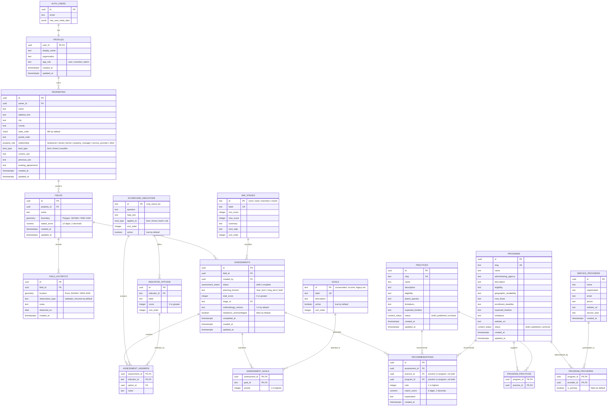

# OARS Database Schema

The schema is organized around four kinds of information: authenticated users, their land and assessments, scientist-managed reference content, and generated recommendations.



## Type and value guide

| Database type | What students should enter | Example |
|---|---|---|
| `uuid` | Generated identifier; users do not type it | `4c728bf1-...` |
| `text` | Names, descriptions, notes, URLs, or codes | `North field` |
| `char(2)` | Two-letter state code | `MD` |
| `integer` | Whole number | score `8`, priority `1` |
| `numeric(12,2)` | Decimal acreage | `42.75` |
| `numeric(8,2)` | Decimal recommendation score | `14.50` |
| `boolean` | True/false value | `true` |
| `date` | Calendar date without a time | `2026-09-03` |
| `timestamptz` | Timestamp stored with timezone awareness | generated by `now()` |
| `jsonb` | Structured JSON owned by Supabase Auth | Google profile metadata |
| `geometry(Polygon,4326)` | Closed longitude/latitude field boundary | GeoJSON polygon converted by PostGIS |
| `geometry(Point,4326)` | Longitude/latitude observation | SWI hotspot at a map location |
| `land_type` | One allowed enum value | `farm`, `forest`, or `both` |
| `property_role` | One allowed enum value | `landowner` or `tenant_farmer` |
| `assessment_status` | Assessment workflow state | `draft` or `complete` |
| `content_status` | Publishing workflow state | `draft`, `published`, or `archived` |

`PK` means primary key, `FK` means foreign key, and `UK` means unique key. Fields without `not null` in the migration are optional and may contain `NULL`.

## Running the migrations

With the Supabase CLI connected to a project:

```bash
supabase db reset
```

For a remote project after reviewing the generated diff:

```bash
supabase db push
```

The first migration creates the schema, indexes, authentication profile trigger, and row-level security policies. The second migration adds the current SWI stages, landowner goals, scorecard questions, and answer options.

## Classroom build order

1. `profiles`, `properties`, and `fields`
2. `assessments`, indicators, options, and answers
3. goals and ranked assessment goals
4. programs, practices, and service providers
5. generated recommendation snapshots
6. PostGIS field boundaries and hotspot queries

Supabase Auth owns passwords and Google OAuth identities in `auth.users`. The application should never create its own password column.
