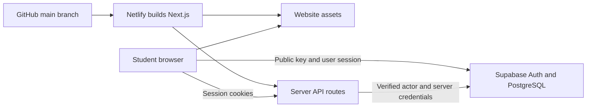

# OARS hosting decision and classroom change guide

Reviewed September 12, 2026. This guide accompanies [PR #9](https://github.com/CaribeCompute/oars-umd-dashboard/pull/9), based on main commit `0d8ed54`. At the time of writing, the PR is open: its changes are not yet on `main` or verified on the live Netlify site.

## Recommendation: Netlify + Supabase for the initial pilot

Use Netlify for the website and its server endpoints, and keep Supabase for authentication and PostgreSQL. This is the shortest tested path from the current project to a small classroom pilot. It is a project-specific recommendation, not a claim that Netlify has the largest free allowance.

Cloudflare Workers is a reasonable alternative if deployment frequency or usage makes Netlify's free plan restrictive. Choosing it would mean validating the Workers deployment, authentication callbacks, server secrets, and CPU usage. Changing hosts does not fix unfinished application workflows.

| Consideration | Netlify Free | Cloudflare Workers Free |
| --- | --- | --- |
| Allowance | Credit-based plan: 300 credits/month, hard limit | 100,000 Worker requests/day; 10 ms CPU per invocation |
| Frequent classroom releases | Production deployments consume 15 credits each | Different request/CPU model; static asset requests are free and unlimited |
| Fit with our current work | PR #9 builds using Next.js and retains server routes | Original source used vinext/Workers; a Workers deployment has not been validated in this task |
| Decision | Recommended for the first small pilot | Reconsider if measured limits prevent free classroom use |

Sources: [Netlify credit plans](https://docs.netlify.com/manage/accounts-and-billing/billing/billing-for-credit-based-plans/credit-based-pricing-plans/) and [Cloudflare Workers pricing](https://developers.cloudflare.com/workers/platform/pricing/). Check the actual account plan: older Netlify accounts may have legacy billing.

Cloudflare's current Next.js guidance recommends vinext for Workers. The original framework choice was not inherently wrong; its build output was intended for another host. [Cloudflare Next.js guide](https://developers.cloudflare.com/workers/framework-guides/web-apps/nextjs/)

## Keeping the pilot at $0

- Stay on the Free plans, use the supplied hosting subdomain, and avoid paid add-ons.
- Develop and test locally. Students propose changes through GitHub PRs; the instructor controls merges to `main`.
- Prefer PR previews while iterating. Netlify does not charge production-deploy credits for previews, but their traffic and compute still count toward usage.
- Batch production releases. Twenty deployments would consume all 300 credits before any traffic. Ten releases consume 150 credits, leaving 150 for other metered usage; this is arithmetic, not a traffic forecast.
- Review Netlify usage after each class and before a demonstration. A free allowance is not a guarantee of uninterrupted availability.
- Check Supabase before class: Free projects can be paused after a week of inactivity. Resume the project in the dashboard when needed. [Supabase pausing policy](https://supabase.com/docs/guides/platform/free-project-pausing)
- Verify email delivery for real test addresses before inviting students. Auth email delivery and database capacity are separate from website hosting limits.

## What each service does



GitHub stores source code. Netlify builds and serves the application. Supabase manages identities and database records. The browser's public key is not a password and does not grant administrator access. Browser database access depends on session identity, grants, and row-level security. Server administration uses an elevated key and must authorize the requesting user before each operation.

## Why the deployment returned 404

The Netlify URL returned HTTP 404 during investigation. The fetched `main` branch still ran `vinext build`, had a Wrangler/Cloudflare runtime, and contained no Netlify build configuration. The earlier Netlify changes existed only in the local working tree; connecting Netlify to `main` could not pick them up.

Those are confirmed source/runtime mismatches. We did not inspect the Netlify dashboard's deployment logs, so the exact publish-directory setting that produced the deployed 404 was not confirmed. Supabase variables alone cannot repair a missing or incompatible website build.

A separate defect would also block a clean build: the root `.gitignore` included a generic `lib/` rule, which hid required `dashboard/lib` source files. Files present on one developer's machine are not automatically present in a GitHub checkout.

## Changes included in PR #9

| Files | Change | Reason students should understand |
| --- | --- | --- |
| `netlify.toml` | Base `dashboard`, command `pnpm build`, publish `.next`; specified Node/pnpm versions | Build configuration must match the framework and hosting runtime |
| `dashboard/package.json`, lockfile | Replaced vinext/Workers tooling with Next.js 16.3.5; added `server-only`; updated dev/build/start commands | Retain the existing App Router and server APIs using Netlify's Next.js support |
| `dashboard/vite.config.ts` | Removed the Cloudflare-specific Vite configuration | The selected build now uses Next.js |
| `dashboard/postcss.config.mjs` | Added Tailwind's PostCSS configuration | Preserve stylesheet compilation after replacing Vite |
| `dashboard/tsconfig.json` | Removed Workers/vinext types and configured Next.js types/plugin | Typechecking must describe the runtime actually used |
| `.gitignore`, `dashboard/.gitignore` | Allowed application `lib` source and `.env.example`; kept real env files ignored | Track code and configuration templates, not credentials |
| `dashboard/lib/utils.ts` | Restored the shared CSS class helper | Shared UI components depend on it |
| `dashboard/lib/supabase/browser.ts` | Added the missing cookie-aware browser client | Connect the existing sign-in UI to Supabase |
| `dashboard/lib/supabase/server.ts` | Added session-aware server client and separately guarded admin client | Keep the elevated key out of browser imports |
| `dashboard/lib/account-types.ts`, `account-policy.ts` | Restored missing account types and policy helpers | Complete imports used by application code and existing tests |
| `dashboard/lib/address-validation.ts` | Restored the missing U.S. address lookup helper | Existing registration routes require address validation |
| `dashboard/.env.example`, `README.md` | Added variable names and deployment instructions | Make local and hosted setup repeatable |

The team had already added Supabase registration, account lifecycle routes, officer workflows, and database migrations to `main`. PR #9 preserves that work; it does not claim to have created those features or completed their end-to-end validation.

## Earlier local experiment versus the selected branch

An earlier pass, based on an older checkout, created a static React/Vite build and a separate Supabase workspace using `oars_test_*` tables. It added property CRUD and assessment snapshots and tested those tables in embedded PostgreSQL. Those changes remain local and were not included in PR #9.

After fetching newer `main`, we found the team's newer server-side integration and prepared the Next.js fix on `codex/netlify-current` instead. For the selected deployment, use the existing `profiles`, `properties`, and related migrations in `dashboard/supabase/migrations`. Do not combine the older static build, its `VITE_*` variables, or its testing migration with this branch.

## Environment variables for the selected Next.js version

| Variable | Where needed | Exposure |
| --- | --- | --- |
| `NEXT_PUBLIC_SUPABASE_URL` | Build and Functions; `.env.local` during local development | Public |
| `NEXT_PUBLIC_SUPABASE_PUBLISHABLE_KEY` | Build and Functions; `.env.local` during local development | Public |
| `SUPABASE_SECRET_KEY` | Functions; `.env.local` for local administrative endpoints | Server only |

Use the project's URL and public key from Supabase Settings. Obtain a newly rotated secret because the previous secret was shared in conversation. No secret value is included in this guide, the environment template, or the commit. Never prefix a secret with `NEXT_PUBLIC_` or `VITE_`, and never put it in `next.config.ts`'s `env` object. A JWKS environment variable is not required by this code.

Public variables are compiled into frontend assets, so rebuild after changing them. Netlify can expose the secret only to Functions where per-scope settings are available; on other plans, keep its server-only name and import boundary. [Supabase API key guidance](https://supabase.com/docs/guides/getting-started/api-keys)

## Run locally and deploy

From a checkout containing PR #9:

```sh
cd dashboard
pnpm install
cp .env.example .env.local
# Enter your values in .env.local, then:
pnpm dev
```

Open `http://localhost:3000`. For a production-style check, stop the development server, run `pnpm build`, then `pnpm start`.

1. Review and merge PR #9 into `main` before using this configuration for production.
2. Configure the variables above in Netlify. Let the committed `netlify.toml` provide build settings. `.next` is relative to the `dashboard` base directory.
3. Set Supabase's Site URL to `https://oars-umd.netlify.app`. Allow `https://oars-umd.netlify.app/auth/callback` and `http://localhost:3000/auth/callback` as redirects.
4. Review the existing remote schema before applying any migration. A reachable `profiles` table does not prove every migration has been applied. Never reset a shared remote database to troubleshoot deployment.
5. Trigger a new Netlify deployment, inspect its build log, and complete the acceptance checks below.

Do not add a catch-all static redirect to `/index.html`. This application has dynamic API routes and an OAuth callback, which Netlify's Next.js adapter handles. [Netlify Next.js configuration](https://docs.netlify.com/snippets/frameworks/nextjs-config-values/)

## What was verified and what remains

| Check | Evidence/status |
| --- | --- |
| Next.js production build and TypeScript | Passed locally |
| Existing account-policy tests | Four passed; these are helper tests, not a full API or RLS audit |
| Local production homepage | HTTP 200 |
| Local account-management request without a session | HTTP 401, `UNAUTHENTICATED` |
| Public Supabase key and `profiles` endpoint | HTTP 200 requesting zero records; no account data retrieved |
| Newly added helper lint | No errors; a PostCSS warning was corrected |
| Remote Netlify deployment | Not validated; PR still pending at documentation time |
| Live login, email confirmation, approval and officer workflows | Require end-to-end testing with configured credentials and test accounts |
| Landowner property editing and assessment persistence | Current Next.js page still contains in-memory demonstration state; refresh persistence is not complete |
| Scientific scores, recommendations and GIS data | Demonstration methodology/content; not scientifically validated |

A deployed homepage is the first operational milestone, not proof that all workflows persist correctly.

## Classroom acceptance exercise

Use two landowners, an officer, and an administrator with test information.

1. Open the deployed page and refresh it. Check browser/network errors and Netlify logs.
2. Register and confirm email. Verify a pending account cannot access protected workflows.
3. Approve one account as administrator and sign in as that landowner.
4. Test an assigned officer and an unassigned officer against the same landowner. Check both the visible UI and direct API authorization.
5. Try property editing and an assessment, then refresh and sign in again. Record persistence gaps as issues rather than assuming a successful screen message means a database write.
6. Exercise deactivation, reactivation, and application consent with test accounts. Confirm rejection paths as well as successful paths.
7. Revisit the Netlify usage meter and record the session's cost against the free allowance.

### Suggested five-minute explanation

“We had an application packaged for one runtime and deployed it to another. We aligned the framework, build command, and output directory with Netlify, restored source files that Git had accidentally ignored, and separated browser configuration from privileged server credentials. We proved that the application builds and basic routes respond correctly. Next we test complete user workflows, database persistence, and access isolation. Hosting and application correctness are separate responsibilities.”
